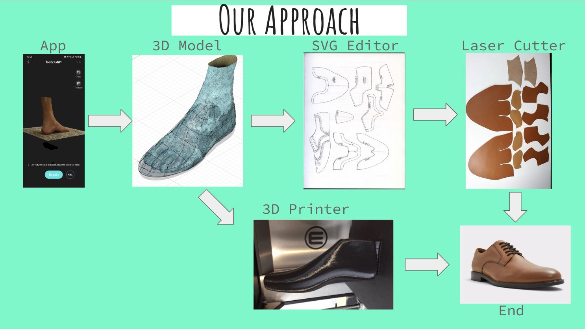
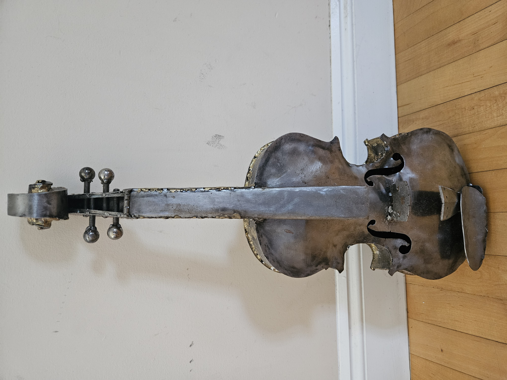

# Portfolio
Visual resume and summary of work experience and personal projects
## Work Experience

### Sierra Wireless - Hardware Electronics Engineer Co-op
Skills: ORCAD, Soldering, Jira, Confluence, Hardware testing/Debugging, SMT soldering, 5g Modules, Documentation (test procedures, technical specification)

### Epic Semiconductors - Application Engieer Co-op
Skills: TinaTI, Spice, EasyEDA, Analog Design, microcontroller, wireless power, wireless communication

### Coding/Robotics Instructor
Skills: Teaching, Coding (Python, Java, Scratch), Robotics (EV3, VEX), 3D Modelling (Sketchup)

## Course Work
### Capstone Project 
Skills: Rasperry Pi, sensor fusion (Lidar, Gryoscope, Accelerometer), Matlab (Ballistics Simulation), SolidWorks, Documentation (Gantt chart, test procedures, project proposal, feasibility analysis, technical specifications, user manuals) 

### Better Bespoke - Mini Dragons Den Pitch
Skills: Public Speaking, 3D modelling

## Additional Skills
### Software - Restaurant Finder App
Skills: Kotlin, Google Maps API, OpenAI API, Android Studio

### Metal Working 
Skills: Hand Tools, Power tools, Arc Welding, Lathe, Brass Soldering 

## Laser Cutting
Skills: Inkscape, SVG design, Leatherworking

# Volunteer Work

# In Progress
Autodesk Certified Professional in AutoCAD for Design and Drafting
Voisu: Singing based rythm game using FFT Audio decomposition in Godot

