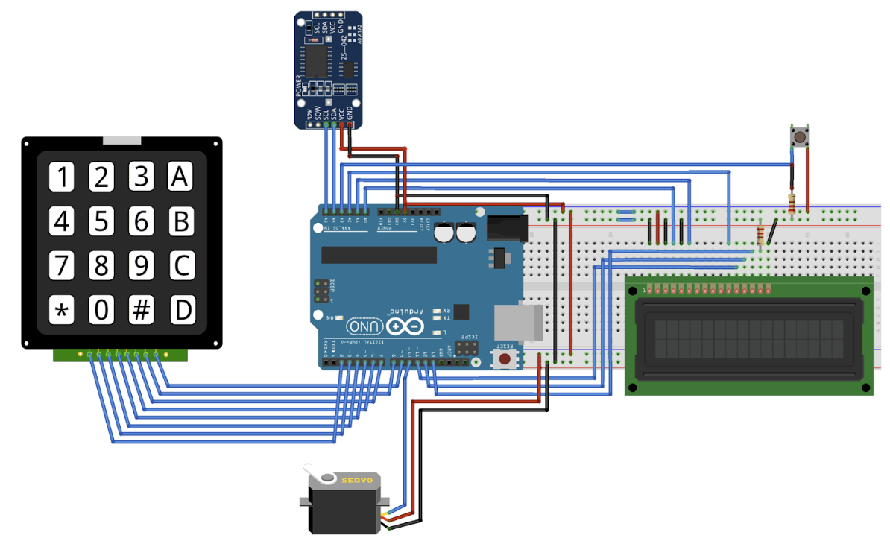
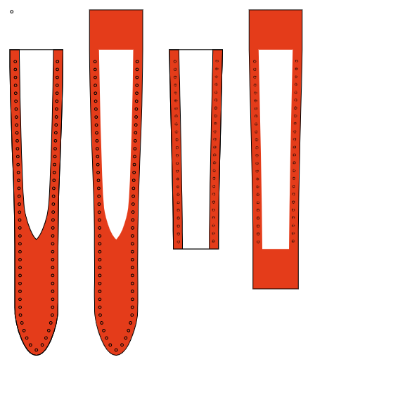
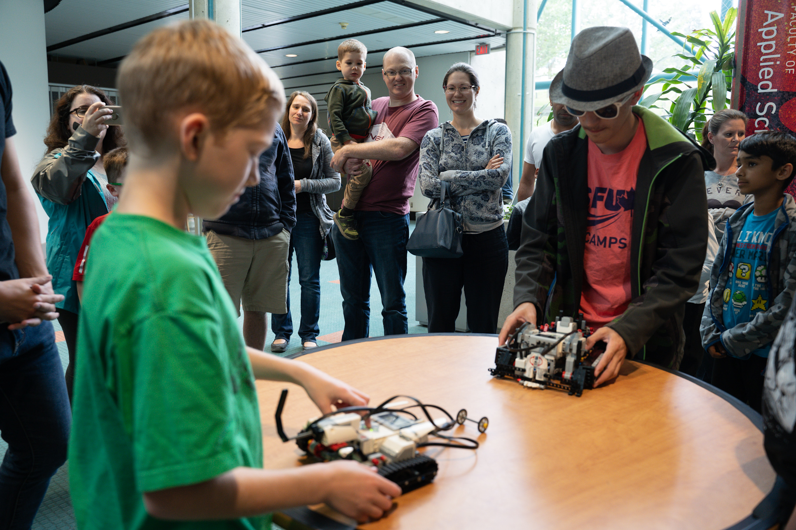
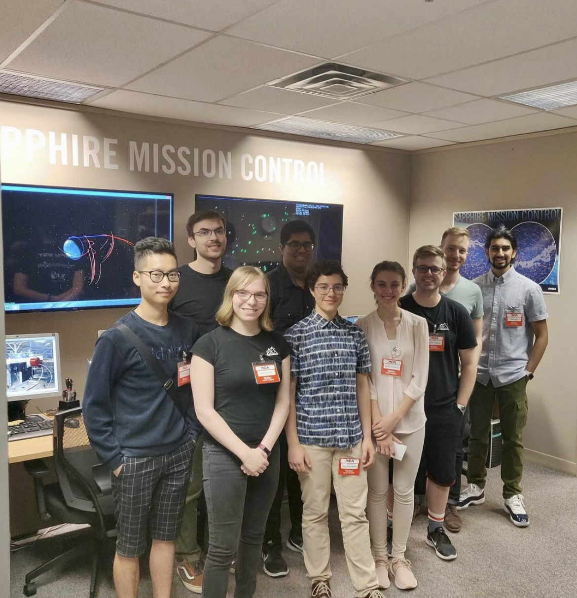
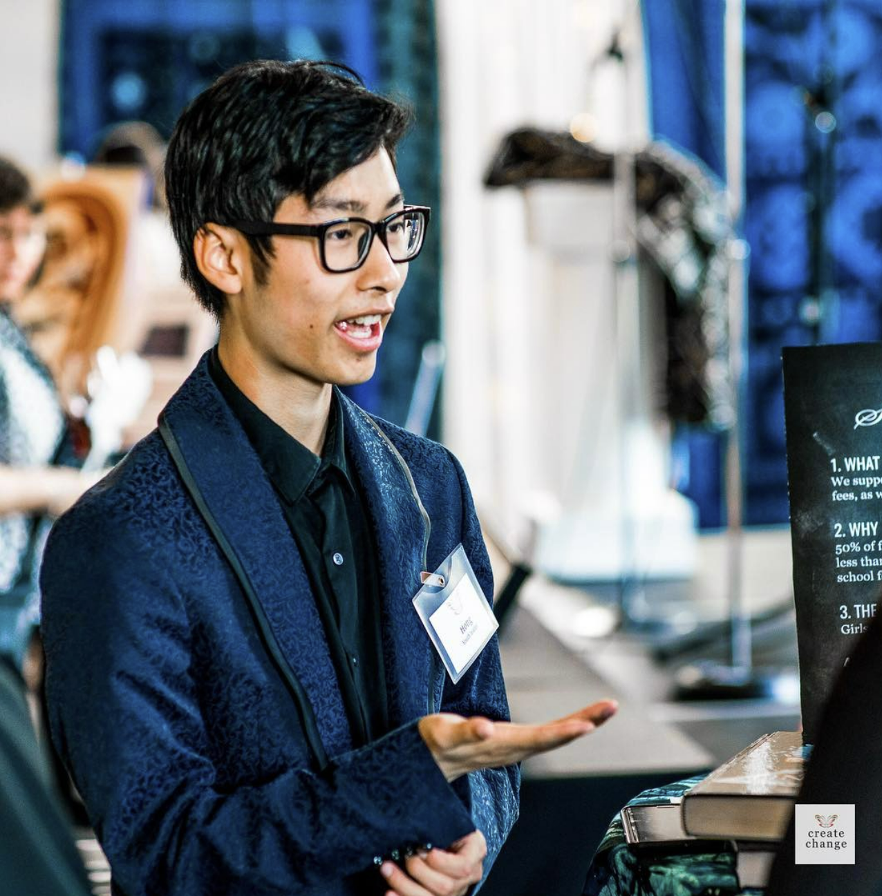

# Portfolio
Visual resume and summary of work experience and personal projects
## Work Experience

### Sierra Wireless - Hardware Electronics Engineer Co-op
Skills: ORCAD, Soldering, Jira, Confluence, Hardware testing/Debugging, SMT soldering, 5g Modules, Documentation (test procedures, technical specification)

Testing and Validation of 5G modules using soldering techiques

### Epic Semiconductors - Application Engineer Co-op
Skills: TinaTI, Spice, EasyEDA, Analog Design, microcontroller, wireless power, wireless communication

Smart button prototype for automotive application

### Coding/Robotics Instructor
Skills: Teaching, Coding (Python, Java, Scratch), Robotics (EV3, VEX), 3D Modelling (Sketchup)

Cat Feeder arduino project for afterschool robotics club

## Course Work
### Capstone Project 
Skills: Rasperry Pi, sensor fusion (Lidar, Gryoscope, Accelerometer), Matlab (Ballistics Simulation), SolidWorks, Documentation (Gantt chart, test procedures, project proposal, feasibility analysis, technical specifications, user manuals) 

Smart Optic System for for Ruger 10/22 (.22LR ammo) using Lidar, Accelerometer, Gyroscope, and transparent Oled display 

### Better Bespoke - Mini Dragons Den Pitch
Skills: Public Speaking, 3D modelling

Mini Dragons Den pitch for bespoke shoe manufacturing process using phone app 3d scanning and 3d modelling

## Additional Skills
### Mechatronics - Power Supply DIY
Skills: Buck-boost, Fusion 360, Electronics

[Project Link]([url](https://github.com/armadail/powersupplyDIY))

Repurposing an old laptop changer into a bench power supply for electronics projects

### Software - Restaurant Finder App
Skills: Kotlin, Google Maps API, OpenAI API, Android Studio

[Project Link]([url](https://github.com/armadail/RestaurantFinder))

Google Maps based Restaurant Finder phone app using OPENAI SDK to parse data

### Metal Working 
Skills: Hand Tools, Power tools, Arc Welding, Lathe, Brass Soldering 

Hand Crafted 1 to 1 ratio of violin using sheet metal, Brass soldering and metal working techniques

## Laser Cutting
Skills: Inkscape, SVG design, Leatherworking

2D SVG design of watch straps for leatherworking

# Volunteer Work
## SFU Aerospace Robotics Camp

End of event robotics battle off tournament

## SFU Sattelie Design Club

Tour of the MDA's mission control center with the SFU Sattelite Design team

## Create Change Fundraiser

Pitching at the Create Change Gala and fundraising for girls education in Ghana

# In Progress
Autodesk Certified Professional in AutoCAD for Design and Drafting

Voisu: Singing based rythm game using FFT Audio decomposition in Godot

